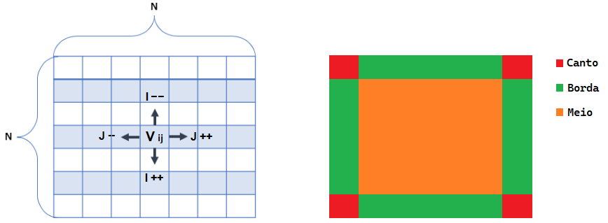

# <b>Contando Intruções</b>
	

Buscando revisar alguns conceitos de programação, foi realizado este pequeno projeto, em que é trabalhado uma filosofia de algoritmos chamada algoritmos gulosos. Neste trabalho caminhamos por uma matriz objetivando sempre a busca pelos maiores valores segundo as regras implementadas, objetivando com isso:

(1) revisar os conceitos de programação básica;

(2) iniciar um cenário de questionamentos para identificar se realmente estou implementando de uma forma otimizada e; 

(3) iniciar uma busca em torno de boa estruturação de código

<h3>Problemática</h3>

Elabore um pequeno programa que utilize uma matriz N x N, com o valor de N fornecido como entrada do programa, para executar a seguinte operação:

1) - Preenche a matriz N x N com números inteiros aleatórios de 0 a 99;

2) - Considere a posição Linha 0 e Coluna 0 (0,0) como início;

3) - Considere a posição (N, N) como posição final;

4) - Percorra a matriz a partir do início, somando a cada passo, o próximo maior valor encontrado;

5) - O próximo valor pode ser o que está na mesma linha e imediatamente à direita, imediatamente à esquerda, bem como, o que está na coluna abaixo do numero corrente;

5.1) Há apenas uma exceção de percurso. Ao chegar na última linha deve-se percorre-la até o fim sem realizar mais migrações para colunas acima.

6) - Andando na matriz conforme as regras acima, qual o maior caminho do início até o final, sabendo-se que a soma das posições representa o tamanho do caminho.
Observe um exemplo logo abaixo para uma matriz com N = 7.

<h3>Solução</h3>

Tecnologia: C++

É fato que para solucionar a problemática introduzida neste projeto existem diversas possibilidades. Todavia, foi se escolhida uma estratégia simples que não requisite tempo gasto no estudo de métodos com grau de dificuldade elevado. Nesse contexto, de acordo com as regras, a lógica consiste em tratar um por um dos possíveis caminhos para determinado elemento da matriz.
 

Para isso, é preciso compreender que um determinado elemento <i>V</i> pode ser acessador pelos paramentros <i>i</i> e <i>j</i>, bem como seus vizinhos:

Além disso, é importante enteder que em certas circunstâncias não será possível dar continuidade no caminho por todas as direções estabeleciadas. Isso ocorre pois a matriz possuí seus limites, e que não devem ser ultrapassados em nenhuma condição. Nessa situação, o alogritimo é capaz de caracterizar certa posição <i>i-j</i> como Canto, Borda e/ou Meio assimilando somente caminhos no interior dos limites da matriz.

Tendo isso em mente, o algoritimo busca comparar os valores vizinhos uns com os outros a fim de verificar o póximo maior valor encontrado. Após encontrar a direção em que o caminho se mantém, o elemento <i>V</i> é modificado com a intenção de evitar comque o programa dê voltas e repita caminhos já percorridos. Desse modo, a função que nos retorna o caminho se torna bem estruturada, podendo mostrar a soma total dos valores contidos no caminho percorrido.

 

<b>Feito por Luan Gonçalves Santos
<b>

